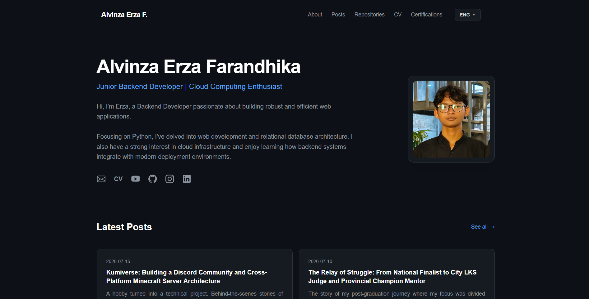

# erza.site

erza.site adalah repositori kode sumber untuk situs web personal dan portofolio profesional resmi. Platform ini berfungsi sebagai representasi digital, resume interaktif, serta ruang pamer untuk proyek-proyek pengembangan perangkat lunak dan infrastruktur teknologi yang telah diselesaikan.

Situs web ini dapat diakses secara publik melalui tautan resmi: **(https://erza.site)**

---

## Status Proyek

* **Status Pengembangan:** Selesai / Production Ready
* **Fase:** Stable Release (Aktif Diperbarui untuk Pembaruan Portofolio)

---

## Fitur Utama

* **Resume & Portofolio Digital:** Menampilkan riwayat pengalaman kerja, pencapaian kompetisi, sertifikasi teknis, dan galeri proyek.
* **Integrasi Showcase Proyek:** Ruang pameran interaktif untuk proyek-proyek open-source dan sistem terdistribusi yang menyertakan tautan repositori serta dokumentasi arsitekturnya.
* **Performa Tinggi & SEO Optimized:** Dibuat dengan arsitektur modern yang memastikan skor performa maksimal, pemuatan halaman yang instan, serta ramah terhadap mesin pencari (SEO).
* **Desain Responsif & Minimalis:** Antarmuka visual yang bersih, profesional, dan sepenuhnya adaptif untuk semua resolusi layar perangkat (seluler, tablet, hingga desktop).

---

## Spesifikasi Teknologi

Teknologi utama yang digunakan untuk membangun situs portofolio ini meliputi:

* **Framework:** Next.js (React)
* **Styling & UI:** Tailwind CSS
* **Deployment & Hosting:** Github Actions

---

## Kebutuhan Sistem

Sebelum menjalankan proyek di lingkungan lokal untuk keperluan modifikasi atau pembaruan data, pastikan perangkat Anda memenuhi spesifikasi berikut:

* Node.js v18.x atau versi yang lebih baru
* Paket manajer `npm` atau `yarn`

---

## Prosedur Instalasi & Pengoperasian Lokal

### 1. Klon Repositori
```bash
git clone https://github.com/vynts/new-portofolio.git
cd erza.site
```
